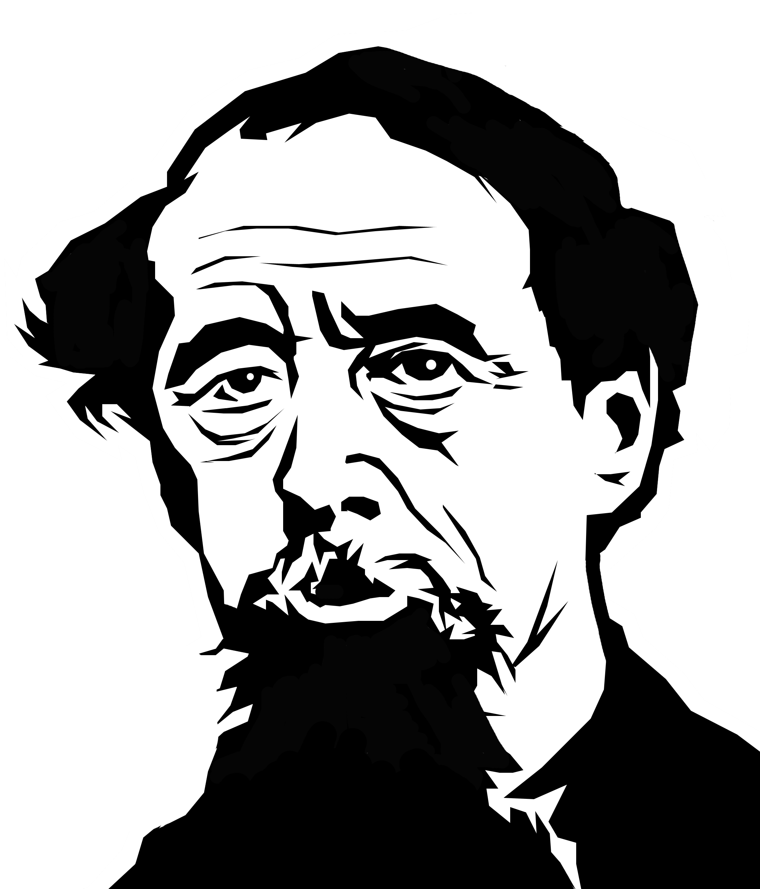

```{r setup, include = FALSE, warning = FALSE}
knitr::opts_chunk$set(echo = TRUE,comment = "",error = F,message = F,
                      warning = F,fig.width = 10,fig.height = 8,fig.align ="center", 
                      fig.retina=1)
```


```{r }
library(tm)
library(wordcloud2)
library(stringr)
library(readr)
library(ggplot2)
library(highcharter)
library(tidyverse)
library(gutenbergr)
library(tidytext)
library(plotly)
library(ggthemr)
library(corpus)
```

#Q1: Top 20 Words Used in Charles Dickens Novels

The 14 most famous novels by Charles Dickens (based on the search results from google) are listed below: 

```{r}
popular_books <-c("A Tale of Two Cities", 
                  "Great Expectations", 
                  "A Christmas Carol", 
                  "Oliver Twist", 
                  "David Copperfield", 
                  "Bleak House", 
                  "Little Dorrit", 
                  "Hard Times", 
                  "Nicholas Nickleby", 
                  "Our Mutual Friend", 
                  "The Pickwick Papers", 
                  "The Old Curiosity Shop", 
                  "Dombey and Son", 
                  "The Mystery of Edwin Drood")
```

## Downloading The Books

I first downloaded these books using the `gutenbergr` package:

```{r}
dickens <- gutenberg_works(author == "Dickens, Charles")
ids <- dickens %>%
  filter(title %in% popular_books) %>%
  select(gutenberg_id) %>%
  unlist() %>% unname()
dickens_books <- gutenberg_download(ids, meta_fields = "title")

```

## Tidying The Text
Then I have extracted words and their frequencies using the `unnest_tokens()` function in the `tidytext` package. This function breaks down a string into a set of *tockens*, such as words, sentences, etc. The function `anti_join()` takes in two arguments, returning all rows from the second one, where there are no matching values in the first.   
I have also included the number of times each word was used in each book as well.

```{r}
tidy_dickens <- dickens_books %>%
  unnest_tokens(word, text) %>%
  anti_join(stop_words) %>%
  group_by(word, title) %>%
  summarise(freq = n()) %>%
  arrange(desc(freq)) %>%
  ungroup() %>%
  group_by(word) %>%
  summarise(description = str_replace_all(toString(paste(freq, paste(title), sep = " times in ")), ",", "\n"), 
         freq = sum(freq)) %>%
  arrange(desc(freq))
```

## Drawing The Plot

```{r}
tidy_dickens$word <- factor(tidy_dickens$word, 
                            levels = tidy_dickens$word[order(tidy_dickens$freq)])

tidy_dickens %>%
  head(20) %>%  
  plot_ly(x=~freq, y=~word, text = ~description, type = 'bar',
          marker = list(color = 'rgb(158,202,225)',
                        line = list(color = 'rgb(8,48,107)',
                                    width = 1.5))) %>% 
  layout(title="Most common words in Charles Dickens Novels",
         plot_bgcolor = "aliceblue",
         titlefont = list(family = "Old Standard TT, serif", 
                          size = 25),
         margin = list(l = 80, b = 50, t = 50, pad = 4),
         xaxis=list(title="Total Occurrences", ticks = "outside"),
         yaxis=list(title = "", ticks = "outside")
  )  %>%
  config(displayModeBar = F, showLink = F)

```


#Q2: Wordcloud of Top 200 Words Used in Charles Dickens Novels

I initially used the picture shown in the homework, but it had a lot of white space and the resulting wordcloud didn't look nice, therefor I made a slight change to this image using Photoshop (Contrary to what it looks like, I do NOT have a lot of free time): 

<div align="center">

</div>

Final image: 

<div align="center">


</div>

Finally, I made the wordcloud:

```{r}
library(wordcloud2)
wordcloud2(data = tidy_dickens %>%
             select(word, freq) %>%
             head(200), 
           figPath = "dickens_final.png", 
           size = .5, color = "black")
```

#Q3: 5 Main Characters in Each Novel


##Extracting The Words

I have first added a column to the data frame, stating whether the word starts with a capital letter or not. Then I've deleted the stopwords. Finally, I've kept the words starting with capital letters and arranged them based on their count.

```{r}
dickens.names <- dickens_books %>%
  unnest_tokens(word, text, to_lower = F) %>%
  mutate(capital = str_detect(word, "^[A-Z]{1}.*")) %>%
  mutate(word = str_to_lower(word)) %>%
  anti_join(stop_words) %>%
  filter(!word %in% c("sir", "miss", "madam")) %>%
  filter(capital) %>%
  group_by(word, title) %>%
  summarise(freq = n())

dickens.sig.names <- dickens.names %>%
  ungroup() %>%
  group_by(title) %>%
  mutate(total = sum(freq)) %>%
  mutate(percentage = freq / total) %>%
  arrange(title, desc(percentage)) %>%
  mutate(rank = as.integer(rank(-percentage))) %>%
  mutate(rank = row_number(rank)) %>%
  filter(rank >= 1 & rank <= 5)
```


## Drawing The Plot


```{r}
dickens.sig.names$word <- factor(dickens.sig.names$word, 
                            levels = dickens.sig.names$word[order(dickens.sig.names$percentage)])
p <- ggplot(dickens.sig.names, aes(x = word, y = percentage)) + 
  geom_bar(aes(fill = title), stat = "identity") + 
  facet_wrap(~title, nrow = 3, ncol = 5, scales = "free") + 
  theme_minimal() +
  theme(axis.title.x = element_blank(), 
        axis.title.y = element_blank(), 
        axis.text.x = element_blank()) + 
  labs(title = "Main Characters\nHover on the bars to see the names.")
ggplotly(p) %>%
  layout(margin = list(l = 80, b = 50, t = 100, pad = 4)) %>%
  hide_legend()

```

#Q4: Sentiment in Charles Dickens Novels

## Using NRC

First of all, to simply visualize the atmosphere of each book, I have used the sentiments in the NRC package. In the next section, I have drawn a plot containing all information about these 14 books. 

```{r}

dickens.sentiment.nrc <- dickens_books %>%
  unnest_tokens(word, text) %>%
  anti_join(stop_words) %>%
  inner_join(get_sentiments("nrc")) %>%
  filter((sentiment != "positive") & (sentiment != "negative")) %>%
  group_by(sentiment, title) %>%
  summarise(count = n()) %>%
  ungroup() %>%
  group_by(title) %>%
  mutate(percentage = count / sum(count)) %>%
  select(sentiment, title, percentage)
```

## Drawing The Plot

From the toolbar on top of the plot, choose the second option from the right (two horizontal lines) for clearer comparison. 
```{r}
dickens.sentiment.nrc %>%
  plot_ly(x = ~title,y = ~percentage, color = ~sentiment) %>% 
  add_bars() %>%
  layout(barmode = 'stack',
         title="Sentiment in Charles Dickens Books",
         yaxis=list(title="Percentage"), 
         xaxis = list(title = ""), 
         margin = list(l = 80, b = 150, t = 50, pad = 4))
```

## Using Bing

Now, since the question has asked for only negative and positive words, I have used this package as shown below: 

```{r}
dickens.sentiment.bing <- dickens_books %>%
  unnest_tokens(word, text) %>%
  anti_join(stop_words) %>%
  inner_join(get_sentiments("bing")) %>%
  group_by(word, title, sentiment) %>%
  summarise(count = n()) %>%
  ungroup() %>%
  group_by(title, sentiment) %>%
  arrange(desc(count)) %>%
  mutate(rank = rank(-count), 
         rank = row_number(rank)) %>%
  filter(rank <= 20) %>%
  ungroup() %>%
  group_by(title) %>%
  mutate(total = sum(count)) %>%
  mutate(count = ifelse(sentiment == "positive", count, -1* count)) %>%
  mutate(percentage = count / total)
```

## Drawing The Plot

It seems like the overall atmosphere in Dickens' books is negative. 

```{r}
p <- ggplot(dickens.sentiment.bing, aes(x = rank, y = percentage, text = word)) + 
  geom_bar(aes(fill = sentiment), stat = "identity", position = "dodge") + 
  geom_label(aes(label = word, color = sentiment), size = 1.5) + 
  facet_wrap(~title, nrow = 3, ncol = 5)  + 
  theme_minimal() +
  theme(legend.position = "none",
        axis.title.x = element_blank(), 
        axis.title.y = element_blank()) + 
  labs(title = "Sentiment in Charles Dickens Books")
ggplotly(p) %>%
  hide_legend()
```


#Q5: 

## Download Les Miserables

```{r}
hugo <- gutenberg_works(author == "Hugo, Victor")
lesmiserables <- gutenberg_download(48731:48735)
#lesmiserables <- read_csv('hugo.csv') %>% filter(!is.na(text))

```

## Partitioning 

```{r}
partition <- ceiling(nrow(lesmiserables) / 200)

wlesp <- lesmiserables %>%
  mutate(word_count = 1:n(), 
         part = word_count %/% partition + 1) %>%
  unnest_tokens(word, text) %>%
  anti_join(stop_words) %>%
  inner_join(get_sentiments("bing")) %>%
  group_by(sentiment, part) %>%
  summarise(count = n()) %>%
  mutate(count = ifelse(sentiment == "negative", -1 * count, count))
```

## Drawing The Plot

```{r}
p <- ggplot(wlesp) + 
  geom_bar(aes(x = part, y = count, fill = sentiment), stat = "identity") + 
  ylab("Sentiment") + 
  ggtitle("Positive and Negative Sentiment in Lés Miserables") +
  scale_color_manual(values = c("gray83", "forestgreen")) +
  scale_fill_manual(values = c("gray83", "forestgreen")) + 
  guides(fill = F, color = F) +
  theme_minimal() + 
  theme(legend.position = "none")
ggplotly(p)

```

## Plotting The Differences

```{r}
wlesp.dif <- wlesp %>%
  ungroup() %>%
  group_by(part) %>%
  mutate(dif = sum(count))

p <- ggplot(wlesp.dif) + 
  geom_bar(aes(x = part, y = dif, fill = (dif > 0)), stat = "identity") +
  ylab("Sentiment") + 
  ggtitle("Positive and Negative Sentiment in Lés Miserables") +
  scale_color_manual(values = c("red", "forestgreen")) +
  scale_fill_manual(values = c("red", "forestgreen")) + 
  guides(fill = F, color = F) +
  theme_minimal() + 
  theme(legend.position = "none")
ggplotly(p) %>%
  hide_legend()
```


#Q6: Top 30 Bigrams Used in Lés Miserables


## Tidying and Gathering The Data
```{r}
fr_stop_words <- stopwords(kind = "fr")
lesmes_bigrams <- lesmiserables %>%
  unnest_tokens(bigram, text, token = "ngrams", n = 2) %>%
  separate(bigram, c("word1", "word2"), sep = " ") %>%
  filter(!word1 %in% fr_stop_words) %>%
  filter(!word2 %in% fr_stop_words) %>%
  filter(!word1 %in% stop_words$word) %>%
  filter(!word2 %in% stop_words$word) %>%
  filter(!str_detect(word1, ".*[[:punct:]].*")) %>%
  filter(!str_detect(word2, ".*[[:punct:]].*")) %>%
  filter(word1 != "chapter") %>%
  count(word1, word2, sort = T) %>%
  mutate(bigram = paste(word1, word2, sep = " ")) %>%
  select(bigram, freq = n) %>%
  head(30)
```

## Drawing The Plot


Seems like the story revolves around everyone's favorite bread-stealing "criminal".

```{r}
lesmes_bigrams$bigram <- factor(lesmes_bigrams$bigram, 
                            levels = lesmes_bigrams$bigram[order(tidy_dickens$freq)])

lesmes_bigrams %>%
  plot_ly(x=~freq, y=~bigram, type = 'bar', 
          marker = list(alpha = 0.5, 
                        line = list(color = "black",
                                    width = 1.5))) %>% 
  layout(title= "Most common bigrams in Lés Miserables",
         xaxis=list(title="Total Occurrences"),
         yaxis=list(title=""), 
         margin = list(l = 150, b = 25, t = 50, pad = 4)
  )  %>%
  config(displayModeBar = F, showLink = F)
```


#Q7: Top 20 Acts Done By Men and Women

First, I've gathered all the bigrams in Dickens' novels. I've filtered out the ones that didn't start with *he* or *she*, using this regex: `^(he|she) [\\w]+`. Afterwards I deleted the stopwords from the verbs (second words).  
Finally, I've stemmed the verbs using the `corpus` library. The `text_tokens()` function from this package takes in a word and strips off common suffixes, so that different tenses of verbs are -almost- the same.

```{r}
dickens_actions <- dickens_books %>%
  filter(!is.na(text)) %>%
  unnest_tokens(bigram, text, token = "ngrams", n = 2) %>%
  separate(bigram, c("word1", "word2"), sep = " ", remove = F) %>%
  mutate(gender = ifelse(word1 == "he", "male", "female")) %>%
  filter(str_detect(bigram, "^(he|she) [\\w]+")) %>%
  filter(!word2 %in% stop_words$word) %>%
  mutate(verb = text_tokens(word2, stemmer = "en")) %>%
  mutate(action = paste(word1, verb, sep = " ")) %>%
  group_by(action, gender) %>%
  summarise(freq = n()) %>%
  ungroup() %>%
  group_by(gender) %>%
  arrange(desc(freq)) %>%
  mutate(rank = rank(-freq), 
         rank = row_number(rank)) %>%
  filter(rank <= 20)

dickens_actions$action <- factor(dickens_actions$action, 
                            levels = dickens_actions$action[order(dickens_actions$freq)])
```

## Drawing The Plot

### Female's Pie Chart

```{r}
plot_ly(dickens_actions %>% 
          filter(gender == 'female') %>%
          mutate(action = str_replace(action, 'she', '')), 
        labels = ~action, values = ~freq, type = 'pie') %>%
  layout(title = 'Top 10 Actions done by Women',
         xaxis = list(showgrid = FALSE, zeroline = FALSE, showticklabels = FALSE),
         yaxis = list(showgrid = FALSE, zeroline = FALSE, showticklabels = FALSE))


```


### Male's Pie Chart

```{r}
plot_ly(dickens_actions %>% 
          filter(gender == 'male') %>%
          mutate(action = str_replace(action, 'he', '')), labels = ~action, values = ~freq, type = 'pie') %>%
  layout(title = 'Top 10 Actions done by Men',
         xaxis = list(showgrid = FALSE, zeroline = FALSE, showticklabels = FALSE),
         yaxis = list(showgrid = FALSE, zeroline = FALSE, showticklabels = FALSE))
```

### Comparison

```{r}
dickens_actions %>%
  plot_ly(x = ~gender, y = ~freq, color = ~as.factor(rank), text = ~action, 
          type = 'bar') %>%
  layout(showlegend = F)
```

#Q8: N-gram Distribution in Charles Dickens Books

First of all, I've devided the books into chapters. Then I've made all the bigrams, calculated the number of times they've occured in each chapter, divided them by the number of times they've occured in each book. 

```{r}
## chapter by chapter
by_chapter <- dickens_books %>%
  group_by(title) %>%
  mutate(chapter = cumsum(str_detect(text, regex("^chapter ", ignore_case = TRUE)))) %>%
  ungroup() %>%
  filter(chapter > 0)

## 1-gram and 2-gram in each chapter 
chapter_1gram<- by_chapter %>%
  unnest_tokens(word, text) %>%
  filter(!is.na(word)) %>%
  anti_join(stop_words) %>%
  group_by(title) %>%
  mutate(total = n()) %>%
  ungroup() %>%
  group_by(title, chapter, word) %>%
  summarise(count = n(), 
            percentage = count / mean(total)) %>%
  ungroup() %>%
  group_by(title, chapter) %>%
  arrange(desc(count)) %>%
  mutate(rank = rank(-count), rank = row_number(rank)) %>%
  filter(rank <= 20)

chapter_2gram<- by_chapter %>%
  unnest_tokens(bigram, text, token = "ngrams", n = 2) %>%
  filter(!is.na(bigram)) %>%
  separate(bigram, c("word1", "word2"), sep = " ") %>%
  filter(!is.na(word1) & !is.na(word2)) %>%
  filter(!word1 %in% stop_words$word) %>%
  filter(!word2 %in% stop_words$word) %>%
  unite(bigram, word1, word2) %>%
  group_by(title) %>%
  mutate(total = n()) %>%
  ungroup() %>%
  group_by(title, chapter, bigram) %>%
  summarise(count = n(), 
            percentage = count / mean(total)) %>%
  ungroup() %>%
  group_by(title, chapter) %>%
  arrange(desc(count)) %>%
  mutate(rank = rank(-count), rank = row_number(rank)) %>%
  filter(rank <= 20)
```


Afterwards, in order to compare the distribution of each book, I've made the 1-grams and 2-grams of each book and plotted the distribution: 

```{r}
unigrams <- by_chapter %>%
  unnest_tokens(word, text) %>%
  filter(!is.na(word)) %>%
  anti_join(stop_words) %>%
  group_by(title) %>%
  mutate(total = n()) %>%
  ungroup() %>%
  group_by(title, word) %>%
  summarise(percentage = n() / mean(total), 
            count = n()) %>%
  ungroup() %>%
  group_by(title) %>%
  arrange(desc(percentage)) %>%
  mutate(rank = rank(-percentage), 
         rank = row_number(rank))


(ggplot(unigrams %>% filter(rank <= 100)) + 
    geom_density(aes(x = count, fill = title), color = 'black') + 
    facet_wrap(~title, scales = 'free') + 
    theme_minimal() + 
    theme(legend.position = "none")) %>% ggplotly()
```


```{r}
bigrams <- by_chapter %>%
  unnest_tokens(bigram, text, token = "ngrams", n = 2) %>%
  separate(bigram, c("word1", "word2"), sep = " ") %>%
  filter(!is.na(word1) & !is.na(word2)) %>%
  filter(!word1 %in% stop_words$word) %>%
  filter(!word2 %in% stop_words$word) %>%
  unite(bigram, word1, word2) %>%
  group_by(title) %>%
  mutate(total = n()) %>%
  ungroup() %>%
  group_by(title, bigram) %>%
  summarise(percentage = n() / mean(total), 
            count = n()) %>%
  ungroup() %>%
  group_by(title) %>%
  arrange(desc(percentage)) %>%
  mutate(rank = rank(-percentage), 
         rank = row_number(rank))

(ggplot(bigrams %>% filter(rank <= 100)) + 
    geom_density(aes(x = count, fill = title), color = 'black') + 
    facet_wrap(~title, scales = 'free') + 
    theme_minimal() + 
    theme(legend.position = "none")) %>% ggplotly()
```

It seems from the above plots, that the distribution of words in charles dickens books are quite the same.  

I've also plotted the distribution of 1-grams in each chapter for *The Mystery of Edwin Drood*: 

```{r}
EdwinDrood <- chapter_1gram %>%
  filter(title == 'The Mystery of Edwin Drood')


ggplot(EdwinDrood, aes(x = percentage, fill = chapter)) + 
  geom_density() + 
  facet_wrap(~chapter, scales = 'free') +
  theme_minimal() +
  theme(axis.text.x = element_blank(), 
        legend.position = "none") 
```

And also the distribution of 2-grams in each chapter for *Hard Times*: 

```{r}
HardTimes <- chapter_2gram %>%
  filter(title == "Hard Times")

ggplot(HardTimes, aes(x = percentage, fill = chapter)) + 
  geom_density() + 
  facet_wrap(~chapter, scales = 'free') +
  theme_minimal() +
  theme(axis.text.x = element_blank(), 
        legend.position = "none") 
```


#Q9: N-gram Distribution in Jane Austen Books

The exact same steps as above has been taken for this section as well (except for one extra part where I compare Dickens to Austen).


Distribution of n-grams in each chapter: 


```{r}
library(janeaustenr)
austen <- austen_books()

aby_chapter <- austen %>%
  group_by(book) %>%
  mutate(chapter = cumsum(str_detect(text, regex("^chapter ", ignore_case = TRUE)))) %>%
  ungroup() %>%
  filter(chapter > 0)

## 1-gram and 2-gram in each chapter 
achapter_1gram<- aby_chapter %>%
  unnest_tokens(word, text) %>%
  anti_join(stop_words) %>%
  filter(!is.na(word)) %>%
  group_by(book) %>%
  mutate(total = n()) %>%
  ungroup() %>%
  group_by(book, chapter, word) %>%
  summarise(count = n(), 
            percentage = count / mean(total)) %>%
  ungroup() %>%
  group_by(book, chapter) %>%
  arrange(desc(count)) %>%
  mutate(rank = rank(-count), rank = row_number(rank)) %>%
  filter(rank <= 20)

achapter_2gram<- aby_chapter %>%
  unnest_tokens(bigram, text, token = "ngrams", n = 2) %>%
  separate(bigram, c("word1", "word2"), sep = " ") %>%
  filter(!is.na(word1) & !is.na(word2)) %>%
  filter(!word1 %in% stop_words$word) %>%
  filter(!word2 %in% stop_words$word) %>%
  unite(bigram, word1, word2) %>%
  group_by(book) %>%
  mutate(total = n()) %>%
  ungroup() %>%
  group_by(book, chapter, bigram) %>%
  summarise(count = n(), 
            percentage = count / mean(total)) %>%
  ungroup() %>%
  group_by(book, chapter) %>%
  arrange(desc(count)) %>%
  mutate(rank = rank(-count), rank = row_number(rank)) %>%
  filter(rank <= 20)
```


Comparison of each book:

1-gram:

```{r}
aunigrams <- aby_chapter %>%
  unnest_tokens(word, text) %>%
  anti_join(stop_words) %>%
  filter(!is.na(word)) %>%
  group_by(book) %>%
  mutate(total = n()) %>%
  ungroup() %>%
  group_by(book, word) %>%
  summarise(percentage = n() / mean(total), 
            count = n()) %>%
  ungroup() %>%
  group_by(book) %>%
  arrange(desc(percentage)) %>%
  mutate(rank = rank(-percentage), 
         rank = row_number(rank))

(ggplot(aunigrams %>% filter(rank <= 100)) + 
    geom_density(aes(x = count, fill = book), color = 'black') + 
    facet_wrap(~book, scales = 'free') + 
    theme_minimal() + 
    theme(legend.position = "none")) %>% ggplotly()
```


2-gram:

```{r}
abigrams <- aby_chapter %>%
  unnest_tokens(bigram, text, token = "ngrams", n = 2) %>%
  separate(bigram, c('word1', 'word2'), sep = ' ') %>%
  filter(!is.na(word1) & !is.na(word2)) %>%
  filter(!word1 %in% stop_words$word) %>%
  filter(!word2 %in% stop_words$word) %>%
  unite(bigram, word1, word2) %>%
  group_by(book) %>%
  mutate(total = n()) %>%
  ungroup() %>%
  group_by(book, bigram) %>%
  summarise(percentage = n() / mean(total), 
            count = n()) %>%
  ungroup() %>%
  group_by(book) %>%
  arrange(desc(percentage)) %>%
  mutate(rank = rank(-percentage), 
         rank = row_number(rank))

(ggplot(abigrams %>% filter(rank <= 100)) + 
    geom_density(aes(x = count, fill = book), color = 'black') + 
    facet_wrap(~book, scales = 'free') + 
    theme_minimal() + 
    theme(legend.position = "none")) %>% ggplotly()
```

Comparing chapters of one book:

1-gram:

```{r}
PridePrejudice <- achapter_1gram %>%
  filter(book == 'Pride & Prejudice')


ggplot(PridePrejudice, aes(x = percentage, fill = chapter)) + 
  geom_density() + 
  facet_wrap(~chapter, scales = 'free') +
  theme_minimal() +
  theme(axis.text.x = element_blank(), 
        legend.position = "none") 
```

2-gram:
```{r}
Emma <- achapter_2gram %>%
  filter(book == "Emma")

ggplot(Emma, aes(x = percentage, fill = chapter)) + 
  geom_density() + 
  facet_wrap(~chapter, scales = 'free') +
  theme_minimal() +
  theme(axis.text.x = element_blank(), 
        legend.position = "none") 
```


Comparison of Charles Dickens and Jane Austen:

1-gram:

as you can see from the test, 1-grams aren't really suitable for determining the difference between two texts. 
```{r}
dickens_imp_1gram <- dickens_books %>%
  unnest_tokens(word, text) %>%
  anti_join(stop_words) %>%
  filter(!is.na(word)) %>%
  mutate(total = n()) %>%
  group_by(word) %>%
  summarise(perc = n() / mean(total)) %>%
  arrange(desc(perc)) %>% head(100)

austen_imp_1gram <- austen %>%
  unnest_tokens(word, text) %>%
  anti_join(stop_words) %>%
  filter(!is.na(word)) %>%
  mutate(total = n()) %>%
  group_by(word) %>%
  summarise(perc = n() / mean(total)) %>%
  arrange(desc(perc)) %>% head(100)

chisq.test(austen_imp_1gram$perc, dickens_imp_1gram$perc)

```

However, bigrams give better results:

```{r}
dickens_imp_2gram <- dickens_books %>%
  unnest_tokens(word, text, token = "ngrams", n = 2) %>%
  separate(word, c('word1', 'word2'), sep = ' ') %>%
  filter(!is.na(word1) & !is.na(word2)) %>%
  filter(!word1 %in% stop_words$word) %>%
  filter(!word2 %in% stop_words$word) %>%
  unite(bigram, word1, word2) %>%
  mutate(total = n()) %>%
  group_by(bigram) %>%
  summarise(perc = n() / mean(total)) %>%
  arrange(desc(perc)) %>% head(100)

austen_imp_2gram <- austen %>%
  unnest_tokens(word, text, token = "ngrams", n = 2) %>%
  separate(word, c('word1', 'word2'), sep = ' ') %>%
  filter(!is.na(word1) & !is.na(word2)) %>%
  filter(!word1 %in% stop_words$word) %>%
  filter(!word2 %in% stop_words$word) %>%
  unite(bigram, word1, word2) %>%
  mutate(total = n()) %>%
  group_by(bigram) %>%
  summarise(perc = n() / mean(total)) %>%
  arrange(desc(perc)) %>% head(100)
chisq.test(dickens_imp_2gram$perc, austen_imp_2gram$perc)
```

#Q10: Predicting Authors

In this section, I attempt to predict the author of *Pride & Prejudice* and *Oliver Twist*.   
In order to achieve this, I have first constructed a list of 20 most frequent bigrams in Dickens' and Austen's books:

```{r}
imp_dickens <- dickens_books %>%
  filter(title != "Oliver Twist") %>%
  unnest_tokens(bigram, text, token = "ngrams", n = 2) %>%
  separate(bigram, c("word1", "word2"), sep = " ") %>%
  filter(!is.na(word1) & !is.na(word2)) %>%
  filter(!word1 %in% stop_words$word) %>%
  filter(!word2 %in% stop_words$word) %>% 
  unite(bigram, word1, word2, sep = " ") %>%
  group_by(bigram) %>%
  summarise(count = n()) %>%
  arrange(desc(count)) %>%
  head(20) 
 
imp_austen <- austen %>%
  filter(book != "Price & Prejudice") %>%
  unnest_tokens(bigram, text, token = "ngrams", n = 2) %>%
  separate(bigram, c("word1", "word2"), sep = " ") %>%
  filter(!is.na(word1) & !is.na(word2)) %>%
  filter(!word1 %in% stop_words$word) %>%
  filter(!word2 %in% stop_words$word) %>% 
  unite(bigram, word1, word2, sep = " ") %>%
  group_by(bigram) %>%
  summarise(count = n()) %>%
  arrange(desc(count)) %>%
  head(20)
```

Afterwards, I've selected all the books except for the two above. This is out training data. I have filtered bigrams that were part of the 40 selected important words and calculated the occurrence percentage of each. 

```{r}
train_dickens <- dickens_books %>%
  filter(title != "Oliver Twist") %>%
  group_by(title) %>%
  mutate(chapter = cumsum(str_detect(text, regex("^chapter ", ignore_case = TRUE)))) %>%
  ungroup() %>%
  filter(chapter > 0) %>%
  unnest_tokens(bigram, text, token = "ngrams", n = 2) %>%
  separate(bigram, c("word1", "word2"), sep = " ") %>%
  filter(!is.na(word1) & !is.na(word2)) %>%
  filter(!word1 %in% stop_words$word) %>%
  filter(!word2 %in% stop_words$word) %>% 
  unite(bigram, word1, word2, sep = " ") %>%
  filter(bigram %in% imp_dickens$bigram) %>%
  mutate(total = n()) %>%
  group_by(title, chapter, bigram) %>%
  summarise(perc = n() / mean(total)) %>%
  spread(key = bigram, value = perc) %>%
  mutate(is_dickens = 1) 

train_austen <- austen %>%
  select(text, title = book) %>%
  filter(title != "Pride & Prejudice") %>%
  group_by(title) %>%
  mutate(chapter = cumsum(str_detect(text, regex("^chapter ", ignore_case = TRUE)))) %>%
  ungroup() %>%
  filter(chapter > 0) %>%
  unnest_tokens(bigram, text, token = "ngrams", n = 2) %>%
  separate(bigram, c("word1", "word2"), sep = " ") %>%
  filter(!is.na(word1) & !is.na(word2)) %>%
  filter(!word1 %in% stop_words$word) %>%
  filter(!word2 %in% stop_words$word) %>% 
  unite(bigram, word1, word2, sep = " ") %>%
  filter(bigram %in% imp_austen$bigram) %>%
  mutate(total = n()) %>%
  group_by(title, chapter, bigram) %>%
  summarise(perc = n() / mean(total)) %>%
  spread(key = bigram, value = perc) %>%
  mutate(is_dickens = 0) 

full_join(train_austen, train_dickens) -> train
train[is.na(train)] <- 0
train <- train %>% ungroup() %>% select(-title, -chapter)
```

Each row of this training data contains information about a chapter of the books. Each column is the selected words. These will be our predictors. The values associated with these predictors are the number of times these words have occurred in the related chapter devided by the total number of occurrences in the book (percentage).  
Now, we try to model our data : 

```{r}
library(h2o)
h2o.init()
htrain = as.h2o(train)
colnames(train) -> colnames_train
hglm = h2o.glm(y = "is_dickens", x= colnames_train,
               training_frame = htrain, family="binomial")
```

Constructing the test data : 

```{r}
pp <- austen %>%
  filter(book == "Pride & Prejudice") %>%
  mutate(chapter = cumsum(str_detect(text, regex("^chapter ", ignore_case = TRUE)))) %>%
  ungroup() %>%
  filter(chapter > 0) %>%
  unnest_tokens(bigram, text, token = "ngrams", n = 2)  %>%
  filter(bigram %in% c(imp_austen$bigram, imp_dickens$bigram)) %>%
  mutate(total = n()) %>%
  group_by(chapter, bigram, book) %>%
  summarise(perc = n() / mean(total)) %>%
  ungroup() %>%
  select(bigram, perc, chapter, book) %>%
  group_by(chapter) %>%
  spread(key = bigram, value = perc)

ot <- dickens_books %>%
  filter(title == "Oliver Twist") %>%
  mutate(chapter = cumsum(str_detect(text, regex("^chapter ", ignore_case = TRUE)))) %>%
  ungroup() %>%
  filter(chapter > 0) %>%
  unnest_tokens(bigram, text, token = "ngrams", n = 2)  %>%
  filter(bigram %in% c(imp_dickens$bigram, imp_austen$bigram)) %>%
  mutate(total = n()) %>%
  group_by(chapter, bigram, title) %>%
  summarise(perc = n() / mean(total)) %>%
  ungroup() %>%
  select(bigram, perc, chapter, book = title) %>%
  group_by(chapter) %>%
  spread(key = bigram, value = perc)


full_join(ot , pp) -> test
test[is.na(test)] <- 0

htest <- as.h2o(test)
```

The error:

The MSE and the LogLoss seem to be relatively small.

```{r}
h2o.performance(hglm)
```


Accuracy:
```{r}
predict <- as.data.frame(h2o.predict(hglm, htest))
test$predict = predict$predict
test <- test %>% select(book, predict) %>%
  mutate(actual = ifelse(book == "Oliver Twist", 1, 0)) %>%
  mutate(accurate = (actual == predict))
acc <- sum(test$accurate) / nrow(test)
print(acc)
```

How much is our prediction off:

```{r}
print(1 - acc)
```

All in all, our model seems to be an adequate fit. 


